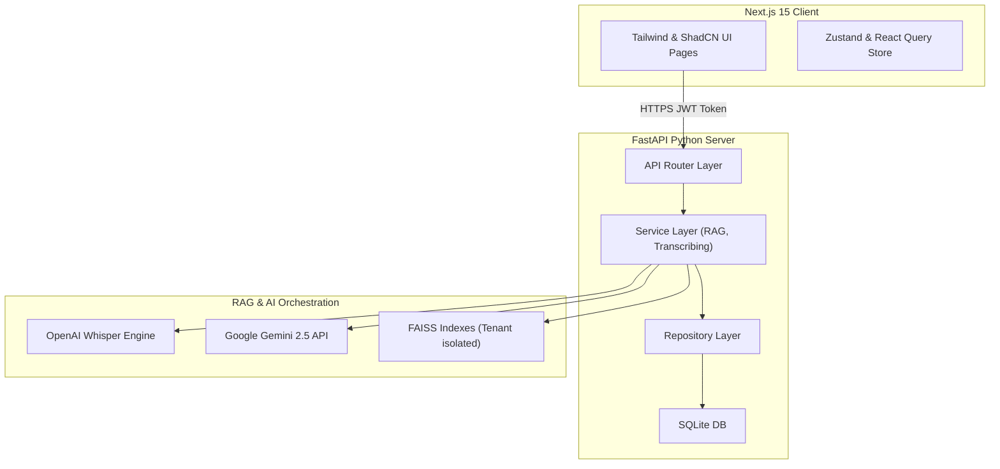
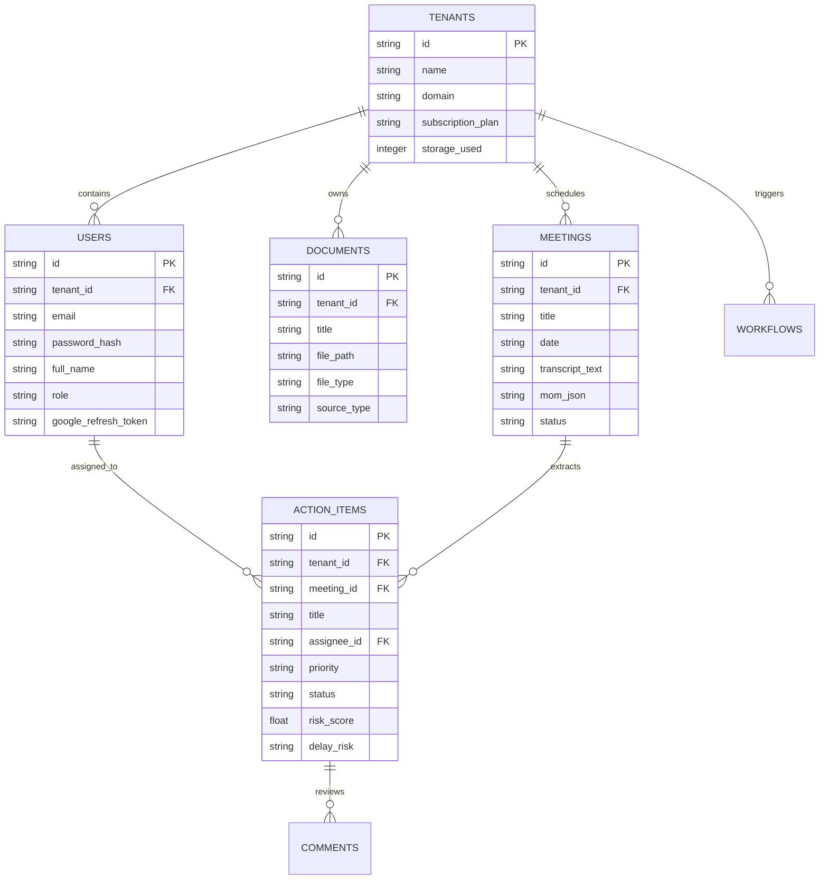
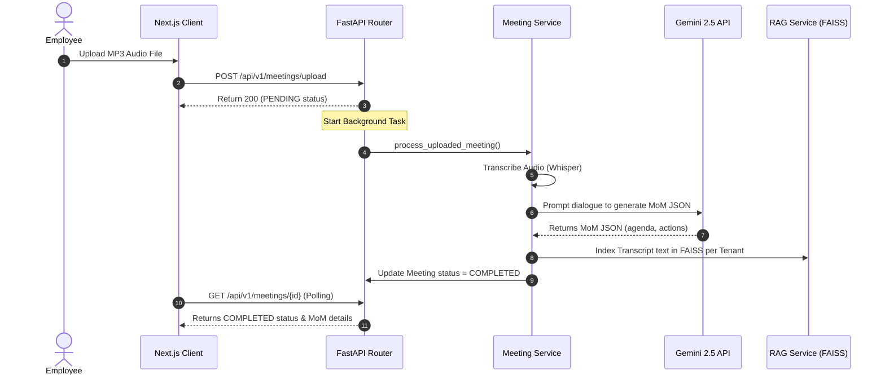

# InsightOrion

### AI-Powered Enterprise Knowledge Intelligence, Meeting Intelligence & Workflow Automation Platform

InsightOrion is a production-grade multi-tenant SaaS collective memory platform. It converts organizational meetings, files, Drive uploads, and Gmail communications into searchable semantic indexes (RAG), automatically constructs professional Minutes of Meetings (MoM), tracks actions priority indicators, and coordinates UiPath business process automation runs.

---

## 1. System Architecture



---

## 2. Relational Database Schema

SQLite schema mappings for multi-tenant isolation:



---

## 3. Core Process Sequence Flow

Sequence diagram for Meeting Upload & MoM Generation:



---

## 4. API Endpoints Directory

### Authentication & Tenants
* `POST /api/v1/auth/register`: Signup a new organization tenant + admin.
* `POST /api/v1/auth/login`: Authenticate email and password, returns JWT token.
* `GET /api/v1/auth/me`: Load profile user info.
* `GET /api/v1/tenants/me`: Load current subscription storage quotas.

### Knowledge Hub (RAG)
* `POST /api/v1/knowledge/upload`: Upload and index document files in FAISS.
* `GET /api/v1/knowledge/search?q={query}`: Query workspace files (returns answer + citations list).
* `POST /api/v1/knowledge/sync/google`: Sync Gmail emails and Google Drive.

### Meetings & Tasks
* `POST /api/v1/meetings/upload`: Upload audio meetings.
* `GET /api/v1/meetings/list`: Fetch processed voice records.
* `GET /api/v1/meetings/{id}`: Load transcript segments and MoM JSON.
* `GET /api/v1/meetings/{id}/export?format={md|docx|html}`: Stream downloadable reports.
* `PUT /api/v1/actions/{id}/status`: Shift Kanban task status and adjust delay risk levels.

---

## 5. Deployment Guide (Docker)

Ensure docker is installed. Create a `.env` file in the root directory:

```env
GEMINI_API_KEY=your-gemini-api-key-here
GOOGLE_CLIENT_ID=your-google-client-id
GOOGLE_CLIENT_SECRET=your-google-client-secret
```

### Launch Services
Build and start the application containers:

```bash
docker-compose up --build
```

* **Frontend Client Portal**: `http://localhost:3000`
* **FastAPI Backend Server**: `http://localhost:8000`
* **Interactive API Swagger Docs**: `http://localhost:8000/docs`

---

## 6. Testing Guide

Run Python tests on the backend models, authentication router, and RAG service:

```bash
cd backend
python -m pytest -v
```
